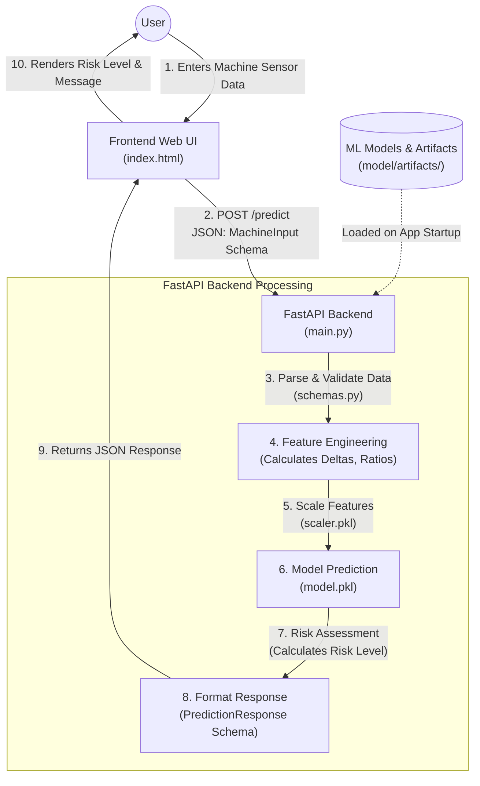

# AI4I Predictive Maintenance Application

An end-to-end machine learning-powered web application that predicts equipment failures and assesses operational risk. Utilizing sensor data (temperatures, rotational speed, torque, tool wear), the system predicts failures in real-time, helping minimize unplanned downtime and optimize maintenance schedules.

This application is built on top of the **AI4I 2020 Predictive Maintenance Dataset** and integrates a machine learning backend with a modern, responsive web dashboard.

---

## 🏗️ Architecture & Workflow

The application consists of a **FastAPI backend** that processes requests, engineers features on the fly, scales inputs, and serves a machine learning model, combined with an interactive **HTML/CSS/JS frontend dashboard**.



For more details on the data flow, see [project_workflow.md](project_workflow.md).

---

## ⚡ Key Features

- **Real-Time Machine Failure Prediction**: Evaluates sensor telemetry to output a binary failure prediction, failure probability, and risk rating.
- **Dynamic Feature Engineering**: Computes advanced features (Power in Watts, Speed-Torque Ratio, Temperature Delta, etc.) dynamically during inference.
- **Modern User Interface**: A clean, premium dashboard designed with Nunito typography, gradient accents, responsive layout, and live health status indicators.
- **Batch Inference Support**: Process multiple machine sensors simultaneously via the batch prediction API endpoint.
- **Dockerized Deployment**: Fully containerized and ready to be run in any Docker environment.

---

## 📂 Project Structure

```text
├── data/
│   └── ai4i2020.csv                # AI4I 2020 dataset used for training
├── model/
│   ├── artifacts/
│   │   ├── model.pkl               # Trained Random Forest classifier
│   │   ├── scaler.pkl              # Scaler for normalizing input telemetry
│   │   ├── label_encoder.pkl       # Label encoder for machine type (L, M, H)
│   │   ├── feature_cols.pkl        # List of columns expected by the model
│   │   └── metadata.json           # Model metadata (accuracy, parameters)
│   └── ai4i_predictive_maintenance.ipynb # Model training & evaluation notebook
├── index.html                      # Interactive web interface
├── main.py                         # FastAPI backend entrypoint & business logic
├── schemas.py                      # Pydantic models for validation
├── Dockerfile                      # Docker image definition
├── requirements.txt                # Python package requirements
├── runtime.txt                     # Python runtime version
└── project_workflow.md             # Visual workflow representation
```

---

## 🚀 Getting Started

### Prerequisites

- Python 3.10+
- Docker (optional)

### Local Setup

1. **Clone the repository and navigate to the project directory:**
   ```bash
   cd Predictive_Maintenance
   ```

2. **Create a virtual environment:**
   ```bash
   python -m venv venv
   source venv/bin/activate  # On Windows: venv\Scripts\activate
   ```

3. **Install dependencies:**
   ```bash
   pip install -r requirements.txt
   ```

4. **Run the FastAPI server:**
   ```bash
   python -m uvicorn main:app --reload
   ```

5. **Access the application:**
   - **Frontend UI:** Open [http://127.0.0.1:8000](http://127.0.0.1:8000) in your browser.
   - **Interactive API Docs (Swagger UI):** Visit [http://127.0.0.1:8000/docs](http://127.0.0.1:8000/docs).

---

## 🐳 Running with Docker

You can easily package and run the application in a lightweight Docker container.

1. **Build the Docker image:**
   ```bash
   docker build -t predictive-maintenance .
   ```

2. **Run the container:**
   ```bash
   docker run -p 8000:8000 predictive-maintenance
   ```

3. **Access the application:**
   - Web application is available at [http://localhost:8000](http://localhost:8000).

---

## 🔌 API Documentation

### 1. Serve UI
- **Endpoint**: `GET /`
- **Description**: Serves the main dashboard user interface `index.html`.

### 2. API Health Check
- **Endpoint**: `GET /health`
- **Response Example**:
  ```json
  {
    "status": "ok",
    "model_loaded": true,
    "features_expected": 13
  }
  ```

### 3. Single Prediction
- **Endpoint**: `POST /predict`
- **Request Body (`MachineInput`)**:
  ```json
  {
    "machine_type": "M",
    "air_temperature": 298.1,
    "process_temperature": 308.6,
    "rotational_speed": 1551.0,
    "torque": 42.8,
    "tool_wear": 0.0
  }
  ```
- **Response Example (`PredictionResponse`)**:
  ```json
  {
    "failure_predicted": false,
    "failure_probability": 0.0125,
    "risk_level": "LOW",
    "message": "✅ Machine operating normally."
  }
  ```

### 4. Batch Prediction
- **Endpoint**: `POST /predict/batch`
- **Request Body**: A JSON list of `MachineInput` objects.
- **Response**: A JSON list of `PredictionResponse` objects.

---

## 📊 Dataset Reference

The dataset consists of 10,000 data points with 14 features:
1. **UID**: Unique identifier ranging from 1 to 10000.
2. **Product ID**: Consists of a letter L (low), M (medium), or H (high) quality variant and a variant-specific serial number.
3. **Air temperature [K]**: Generated using a random walk process later normalized around 300 K.
4. **Process temperature [K]**: Generated using a random walk normalized around 310 K.
5. **Rotational speed [rpm]**: Calculated from a power of 2860 W, overlaid with noise.
6. **Torque [Nm]**: Torque values are normally distributed around 40 Nm.
7. **Tool wear [min]**: The tool wear increases over time depending on the machine type.
8. **Machine failure**: Label indicating whether the machine has failed in this data point.
