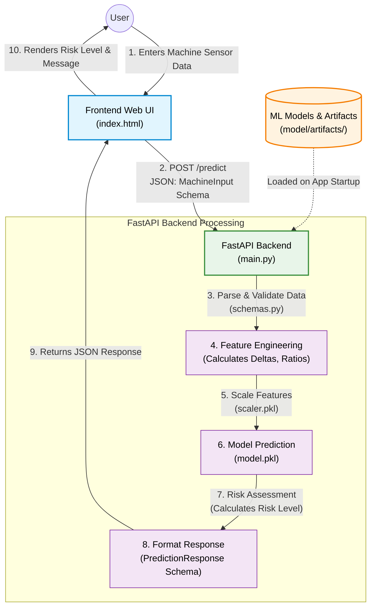

# Predictive Maintenance Project Workflow

This document illustrates the end-to-end workflow of the AI4I Predictive Maintenance application, showing how data moves from the user interface through the backend to the machine learning model and back.

## Workflow Steps

1. **User Input:** The user fills out a form on the web interface (`index.html`) with machine parameters like air temperature, rotational speed, torque, etc.
2. **API Request:** The frontend sends a `POST` request containing a JSON payload to the backend's `/predict` endpoint.
3. **Validation:** FastAPI validates the incoming JSON against the `MachineInput` schema defined in `schemas.py`.
4. **Feature Engineering:** The backend constructs the final feature array by combining original inputs with engineered features (e.g., temperature delta, power in watts, speed-torque ratio) to match the model's expected format.
5. **Scaling:** The features are scaled using a pre-fitted scaler (`scaler.pkl`).
6. **Prediction:** The scaled features are passed to the trained Random Forest model (`model.pkl`) to predict failure and calculate failure probability.
7. **Risk Assessment:** The probability is mapped to a risk level (LOW, MEDIUM, HIGH, CRITICAL).
8. **Response Formatting:** The backend structures the response into a `PredictionResponse` schema.
9. **API Response:** The JSON response is sent back to the frontend.
10. **UI Update:** The frontend updates the user interface to display whether maintenance is required, the failure probability, and the assessed risk level.
